<div align="center">

# VAULTLESS

### Passwordless Biometric Authentication Anchored to Solana

*Your key is how you move.*

[](https://vaultless-sys.vercel.app)


</div>

---

## Table of Contents

1. [What is Vaultless](#1-what-is-vaultless)
2. [The Problem it Solves](#2-the-problem-it-solves)
3. [Who it is For](#3-who-it-is-for)
4. [Project Architecture](#4-project-architecture)
5. [How it Works: The Full Flow](#5-how-it-works-the-full-flow)
6. [The Science: Fuzzy Extractor and Z-Score Normalisation](#6-the-science-fuzzy-extractor-and-z-score-normalisation)
7. [Why Solana, and How We Use It](#7-why-solana-and-how-we-use-it)
8. [Platform Support: Web, Mobile, and SDK](#8-platform-support-web-mobile-and-sdk)
9. [Demo Mode vs Real Mode](#9-demo-mode-vs-real-mode)
10. [The Duress Protocol: Ghost Wallet](#10-the-duress-protocol-ghost-wallet)
11. [Authentication Outcomes](#11-authentication-outcomes)
12. [Smart Contract Reference](#12-smart-contract-reference)
13. [Repository Structure](#13-repository-structure)
14. [Local Setup](#14-local-setup)
15. [Environment Variables](#15-environment-variables)
16. [Tuning the DNA Engine](#16-tuning-the-dna-engine)

---

## 1. What is Vaultless

Vaultless is a **passwordless, biometric authentication system** that uses your typing rhythm as a cryptographic identity. There is no password to create, store, steal, or forget. Instead, the cadence of how you type a short phrase — the precise timing between keystrokes, how long each key is held, and on mobile, how your phone moves in your hand — is converted into a deterministic cryptographic key using a Fuzzy Extractor.

That key is used to sign transactions on **Solana**. Your behavioural DNA is never stored anywhere. The only thing that lives on-chain is the Fuzzy Extractor's helper data, which is mathematically useless without the original typing pattern that generated it.

> Your secret is not something you know. It is something you are.

<div align="center">

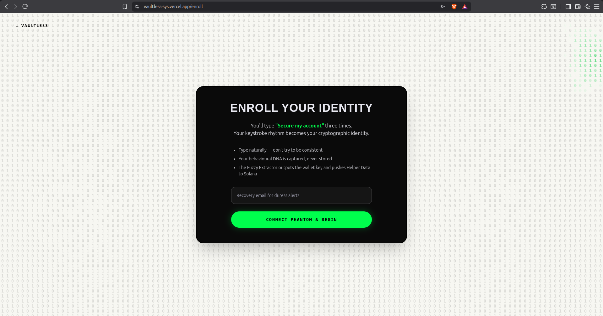

*Enrollment screen: your keystroke rhythm becomes your cryptographic identity*

</div>

---

## 2. The Problem it Solves

Passwords are broken. Not just in theory — in practice, every major breach in recent memory traces back to a static credential that was stored somewhere it should not have been, phished out of a user who did not know better, or coerced from someone under duress.

The next generation of authentication — 2FA, hardware tokens, passkeys — is better, but it still has a fundamental flaw: **it cannot detect if the person authenticating is acting freely**. If someone holds a gun to your head and tells you to log in, your biometric fingerprint, your hardware token, and your PIN will all comply without complaint.

Vaultless is built around three failure modes that existing systems do not address:

- **Credential theft:** A stolen password or leaked seed phrase gives an attacker complete access. Vaultless has no stored credential to steal. The key is reconstructed live from your typing and immediately discarded.
- **Phishing and replay attacks:** Static credentials can be captured and replayed. A behavioural biometric is a live reading; replaying a recording of keystrokes produces a different timing vector.
- **Coercion:** If you are forced to authenticate, Vaultless detects elevated stress in your typing rhythm and silently activates a Ghost Wallet, showing the attacker a fake balance while your real funds remain untouched and an alert is dispatched to your recovery email.

---

## 3. Who it is For

Vaultless is designed to be deployed in multiple contexts, from individual crypto users to enterprise security infrastructure.

| Deployment Context | Value Delivered |
|---|---|
| **Crypto Wallet Users** | Eliminates seed phrase risk entirely. No phrase to lose, forget, or have stolen. |
| **Enterprises** | Drop-in behavioural 2FA layer on top of existing login flows via the SDK. |
| **Activists and Journalists** | The duress mode protects high-risk users without alerting an attacker that they failed to gain access. |
| **Financial Institutions** | On-chain audit trail of authentication events with tamper-proof timestamps. |
| **Consumer Apps** | The SDK exposes a simple API: capture typing, compare, decide. No blockchain knowledge required for the integration developer. |
| **Elderly and Low-Tech Users** | No passwords to remember. The phrase stays the same; the rhythm is natural and automatic. |

**Vaultless as a 2FA layer:** The core engine is packaged as `@vaultless/core`, an SDK that any application can integrate. A developer wraps their existing login with the Vaultless typing capture widget. After the user passes their standard credential check, Vaultless performs a second, invisible layer of behavioural verification. If the score drops into the duress zone, the app can trigger its own silent alert flow without exposing any blockchain complexity to the end user.

---

## 4. Project Architecture

<div align="center">

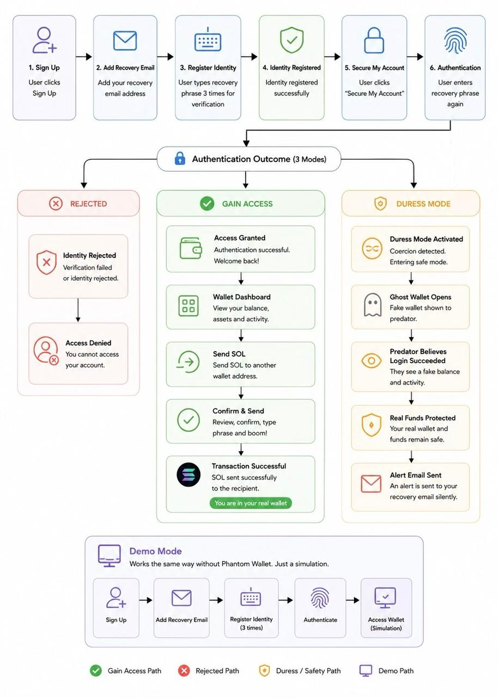

*Complete system flow: enrollment, authentication outcomes, and the Ghost Wallet path*

</div>

The system is split into four layers that operate independently and communicate through well-defined interfaces.

```
VAULTLESS/
  apps/
    web/          React + Vite frontend (the main product)
    mobile/       React Native (Expo) mobile app
  program/        Solana Anchor smart contract (Rust)
  packages/
    core/         @vaultless/core SDK (shared biometric engine)
```

**Behavioural Engine (`behaviouralEngine.js` / `MobileBehaviouralEngine.js`)**

The engine captures raw keystroke events using `performance.now()` for sub-millisecond precision. It builds a `Float32Array[64]` feature vector from the captured session:

- Indices `[0-19]`: Hold times per key (weighted 3x in cosine similarity — the most discriminative feature)
- Indices `[20-39]`: Flight times between adjacent keys (weighted 2x)
- Indices `[40-45]`: Aggregate statistics — average hold, standard deviation of hold, average flight, standard deviation of flight, total typing duration, and rhythm variance
- Indices `[46-50]`: Mouse and pointer dynamics on web — average velocity, velocity variance, average acceleration, direction change count, and click-hold duration
- Indices `[51-63]`: Zero-padded reserved space

**Solana Program (`program/programs/vaultless/src/lib.rs`)**

A Rust/Anchor program deployed to Solana Devnet. It manages one `Identity` account per wallet, stored at a Program Derived Address (PDA) seeded from the wallet public key. The program exposes four instructions: `initialize_identity`, `update_identity`, `trigger_duress`, and `authenticate`.

**Frontend (`apps/web/src/`)**

A React + Vite SPA with four main pages: `Enroll`, `Auth`, `Dashboard`, and `Ghost`. Routing between these pages follows the authentication outcome produced by the behavioural engine.

**Mobile (`apps/mobile/`)**

A React Native (Expo) app that extends the biometric signal with accelerometer and gyroscope data from the device's IMU, sampled at 20Hz during the typing session.

---

## 5. How it Works: The Full Flow

### Step 1: Connect and Set Recovery Email

The user visits the enroll page and connects their Phantom wallet. They enter a recovery email address, which is used exclusively for duress alerts. No account is created at this stage.

<div align="center">


</div>

### Step 2: Register Your Identity (3 Captures)

The user types the phrase `"Secure my account"` three times. Each typing session is independently converted to a feature vector. The three vectors are averaged into a single enrollment baseline. A live EKG-style visualisation shows the keystroke rhythm in real time.


<div align="center">

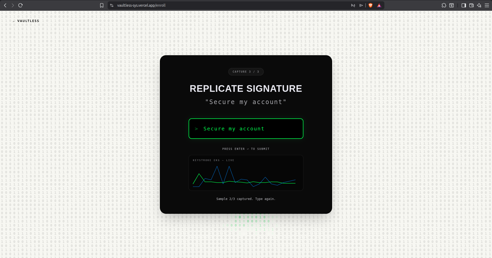

*Capture 3 of 3:  the live EKG visualises keystroke hold and flight times as they happen, the blue line shows the previous capture for reference*

</div>

### Step 3: Fuzzy Extractor Runs, Key Pushed to Solana

After three captures, the Fuzzy Extractor processes the averaged vector and outputs:
- A **deterministic secret key** (the wallet signing key)
- **Helper Data** (a mathematical correction structure that allows the same key to be re-derived from a future typing session that is close, but not identical, to the enrollment baseline)

The helper data is stored on Solana in the user's Identity PDA. The secret key is used immediately to derive the wallet public key, and then discarded — it is never written to disk or localStorage.

<div align="center">

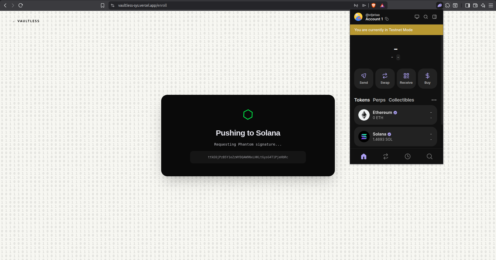

*Helper data being pushed to Solana via Phantom signature*

</div>

<div align="center">

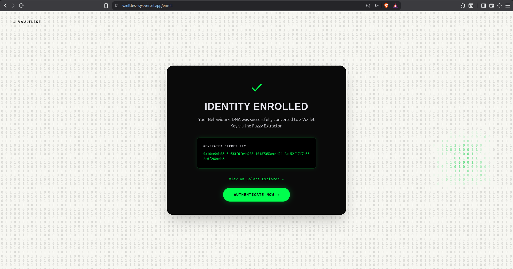

*Enrollment complete: the generated secret key is shown briefly, then discarded*

</div>

### Step 4: Access Your Wallet

On returning to the app, the user lands on the Access page and clicks Authenticate. They type the same phrase once more.

<div align="center">

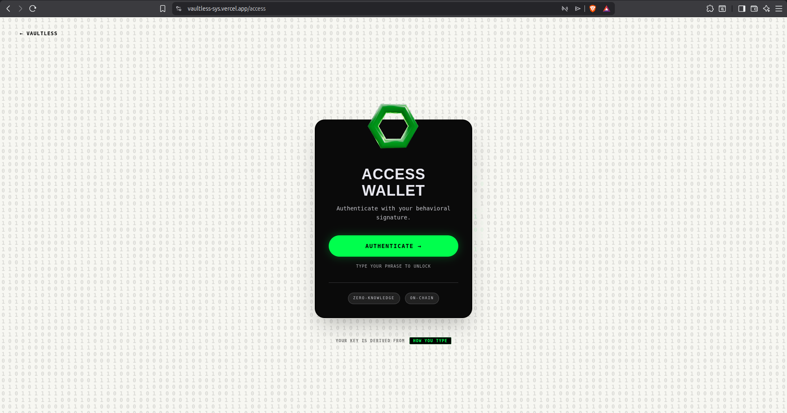

</div>

### Step 5: Live Scoring

The new typing session is converted to a vector. The Fuzzy Extractor uses the stored helper data to reconstruct the secret key. Cosine similarity is computed between the current vector and the enrollment baseline. The score determines which path the user is routed to.

<div align="center">

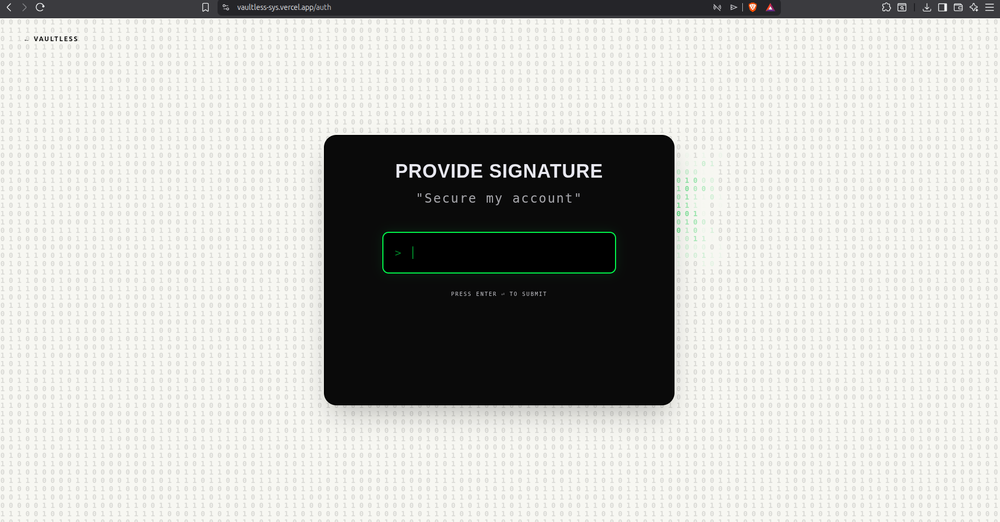

*Authentication page: one typing of the phrase is all that is required*

</div>

<div align="center">

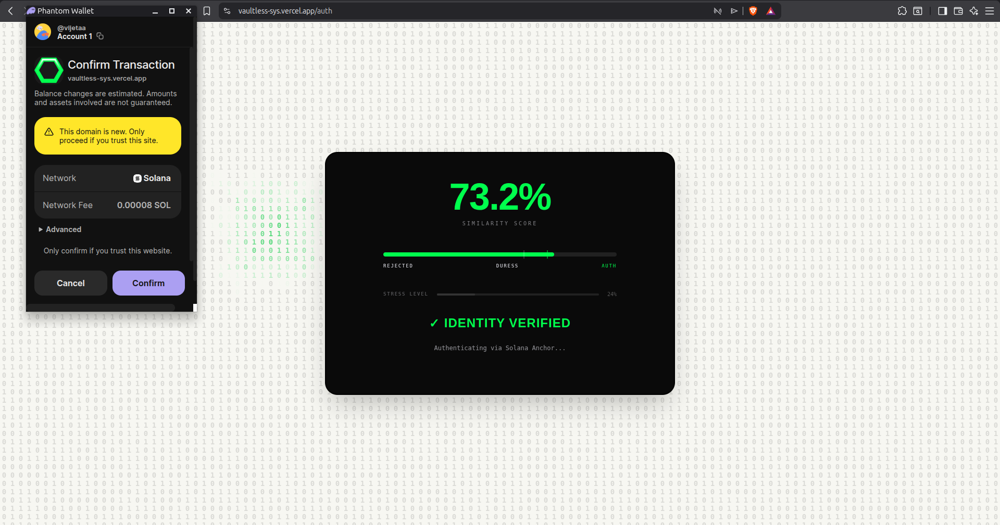

*73.2% similarity: identity verified, authenticating via Solana Anchor*

</div>

### Step 6: Dashboard and Live Wallet

On successful authentication, the user reaches the biometric wallet dashboard showing their real SOL balance and on-chain activity log. The wallet is fully functional on Solana Devnet.

<div align="center">

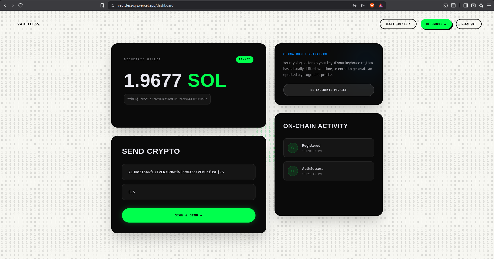

*Live biometric wallet: balance, on-chain activity log, DNA drift detection, and send interface*

</div>

### Step 7: Signing a Transaction with Your Typing

To send SOL, the user types the phrase once more in the Sign Transaction modal. The Fuzzy Extractor reconstructs the secret key from that single typing, uses it to sign the Solana transaction, and the key is immediately discarded. Phantom wallet prompts for final confirmation.

<div align="center">

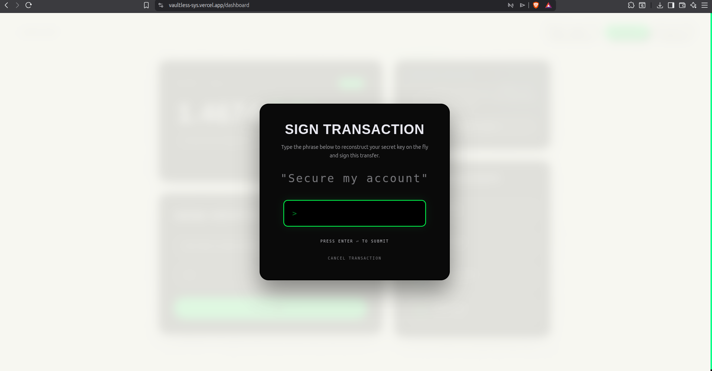

*Transaction signing modal: typing the phrase reconstructs the key on the fly*

</div>

<div align="center">

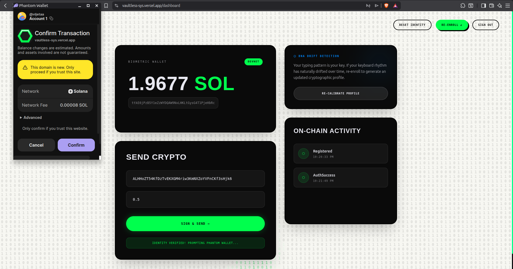

*Phantom wallet confirmation prompt after identity is verified*

</div>

<div align="center">

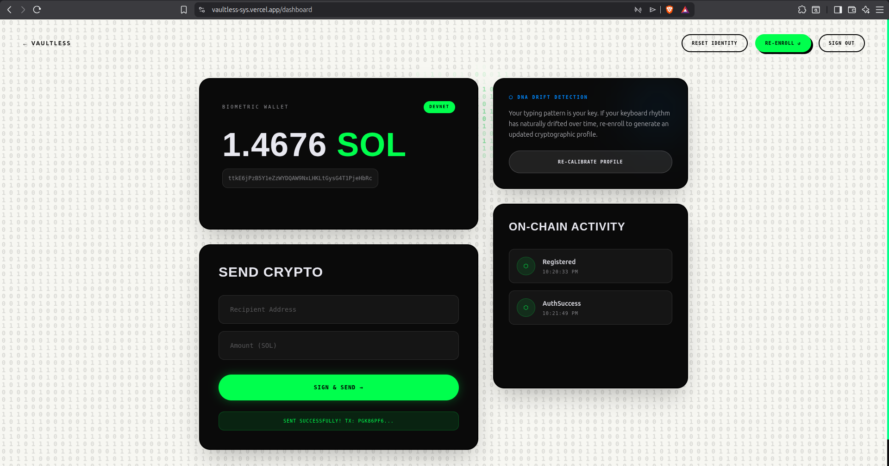

*Transaction confirmed: SOL sent successfully to the recipient address*

</div>

---

## 6. The Science: Fuzzy Extractor and Z-Score Normalisation

### Fuzzy Extractor

The core mathematical challenge of biometric authentication is that biometric readings are **noisy** — your typing today will not be byte-for-byte identical to your typing yesterday. A classic cryptographic hash fails here because even a single-bit difference produces a completely different output.

A Fuzzy Extractor solves this. It is a two-function system:

- `Gen(w)`: Takes a biometric reading `w` at enrollment. Outputs a secret key `R` and helper data `P`. The key `R` is stored nowhere. The helper data `P` is stored on-chain.
- `Rep(w', P)`: Takes a new reading `w'` at authentication and the stored helper data `P`. If `w'` is within a defined error tolerance of the original `w`, it reproducibly outputs the same key `R`. If `w'` is too different (an impostor, or a coerced user typing with elevated stress), it outputs garbage.

The helper data `P` is mathematically designed so that possessing it alone reveals nothing about the original biometric or the key. It is safe to store publicly on-chain.

### Z-Score Normalisation

Raw keystroke timing measurements vary between sessions due to factors unrelated to identity — fatigue, different keyboards, ambient temperature. Before computing similarity, each feature in the vector is Z-score normalised:

```
z = (x - mean) / std_deviation
```

This transforms absolute timing values into relative ones — how many standard deviations each measurement sits from the enrollment mean. Two people typing the phrase in 2.0 seconds vs 1.8 seconds appear as a massive difference in raw timing, but near-identical after normalisation if their internal rhythm pattern is the same.

### Cosine Similarity and Weighted Scoring

The similarity between two feature vectors is computed as cosine similarity, with differential weighting applied to the feature groups:

| Feature Group | Weight | Rationale |
|---|---|---|
| Hold times per key | 3x | Most stable, most discriminative biometric |
| Flight times between keys | 2x | Strong signal, slightly more variable |
| Aggregate statistics | 1x | Supporting context |
| Mouse/pointer dynamics (web) | 1x | Adds a second independent signal channel |

### Stress Detection

Separately from the identity score, a stress detector runs in parallel. It computes the variance in keystroke rhythm during the current session and compares it to the variance recorded during enrollment. If the live variance exceeds twice the enrollment variance, the system infers elevated stress — a signal consistent with coercion — and routes the session toward the duress protocol regardless of whether the identity score alone would have passed.

```
stress_detected = liveRhythmVariance > enrollmentRhythmVariance * 2
```

---

## 7. Why Solana, and How We Use It

Most biometric authentication systems store their data in a centralised database. This creates a single point of failure: compromise the database, and every enrolled identity is at risk. Vaultless uses Solana to make the identity registry **decentralised, tamper-proof, and publicly auditable**.

**Why Solana specifically:**

- **Speed:** Solana finalises transactions in approximately 400ms. The helper data write during enrollment and the authentication log during sign-in are nearly instant, making them invisible to the user in terms of latency.
- **Cost:** Transaction fees on Solana are a fraction of a cent. Storing 4KB of helper data on Ethereum mainnet would cost several dollars per enrollment. On Solana Devnet (and mainnet), it is negligible.
- **PDA architecture:** Solana's Program Derived Addresses allow us to derive a deterministic, unique on-chain address for each user's Identity account from just their wallet public key and a constant seed. No registry mapping is needed. Any party can look up any identity account directly.
- **Anchor framework:** The Rust/Anchor program provides type-safe account validation, automatic discriminator checks, and composable instruction handlers that make the on-chain logic straightforward to audit.

**What lives on-chain:**

| Field | Type | Description |
|---|---|---|
| `owner` | `Pubkey` | The wallet address that owns this identity |
| `helper_data` | `String` (max 4096 bytes) | Fuzzy Extractor helper data |
| `enrolled_at` | `i64` | Unix timestamp of enrollment |
| `last_auth_at` | `i64` | Unix timestamp of last successful authentication |
| `is_locked` | `bool` | Set to true when duress protocol fires |

**What never touches the chain:** The secret key derived from the typing pattern. It is computed in memory, used to sign the transaction, and immediately discarded. Solana validators never see it.

---

## 8. Platform Support: Web, Mobile, and SDK

### Web App

The web app at `vaultless-sys.vercel.app` captures two independent biometric channels simultaneously:

- **Keystroke dynamics:** Hold times and flight times per key, using `performance.now()` at sub-millisecond resolution.
- **Mouse and pointer dynamics:** Cursor velocity, acceleration, direction changes, and click-hold duration during the typing session.

Both signals are combined into the single `Float32Array[64]` feature vector before the Fuzzy Extractor processes it.

### Mobile App (React Native / Expo)

The mobile app adds a third biometric channel that the web version cannot access: **inertial measurement unit (IMU) data** from the device's hardware sensors.

During a typing session, the app simultaneously records:

- **Accelerometer data** at 20Hz: The physical movement of the phone while typing reveals grip pressure, hand stability, and posture.
- **Gyroscope data** at 20Hz: The rotational dynamics of the device during typing add another layer of uniqueness.

The mobile feature vector includes:

```javascript
{
  flightTimes,         // Inter-key timing array
  flightTimesZ,        // Z-score normalised flight times
  avgFlight,           // Mean flight time
  avgAccMag,           // Mean accelerometer magnitude
  stdAccMag,           // Std dev of accelerometer magnitude
  avgGyroMag,          // Mean gyroscope magnitude
  stdGyroMag           // Std dev of gyroscope magnitude
}
```

This means a mobile enrollment and a desktop enrollment produce different (and non-interchangeable) profiles, each capturing biometric signals unique to that device context.

### SDK: `@vaultless/core`

The core biometric engine is extracted into a standalone package that any JavaScript or TypeScript application can import.

```javascript
import {
  mean,
  std,
  variance,
  zNormalize,
  cosineSimilarity,
  classifyScore,
  detectStress,
  TRUST_POLICIES
} from '@vaultless/core';
```

This enables Vaultless to function as a **drop-in behavioural 2FA layer** for any application. The integrating app does not need to know anything about Solana, Anchor, or the Fuzzy Extractor. It captures typing, calls `cosineSimilarity()` against a stored enrollment vector, calls `classifyScore()` to get an `AUTH`, `DURESS`, or `REJECTED` result, and branches its own flow accordingly.

**Enterprise integration pattern:**

```javascript
// After your existing credential check passes:
const liveVector = captureTyping(phrase);
const score = cosineSimilarity(liveVector, enrollmentVector);
const outcome = classifyScore(score, TRUST_POLICIES.STANDARD);

if (outcome === 'DURESS') triggerSilentAlert();
if (outcome === 'AUTH') grantAccess();
if (outcome === 'REJECTED') denyAccess();
```

---

## 9. Demo Mode vs Real Mode

Vaultless ships with a Demo Mode that allows the full authentication experience without requiring a Phantom wallet or any SOL.

| Feature | Demo Mode | Real Mode |
|---|---|---|
| Keystroke capture | Yes | Yes |
| Fuzzy Extractor | Yes (in-browser simulation) | Yes (full implementation) |
| Helper data storage | localStorage only | Solana Devnet (on-chain) |
| Wallet balance | Simulated | Live Solana Devnet balance |
| Send SOL | Simulated transaction | Real Solana Devnet transfer |
| Duress detection | Yes | Yes |
| Ghost Wallet | Yes | Yes |
| Recovery email alert | Yes (EmailJS) | Yes (EmailJS) |
| Phantom wallet required | No | Yes |

In Demo Mode, the enrollment and authentication flow is identical. The only difference is that helper data is stored in localStorage instead of a Solana PDA, and transactions are simulated rather than broadcast. This allows a judge, investor, or user to experience the full product without any wallet setup.

Toggle demo mode in `CONTEXT.md`:

```
DEMO_MODE: true   <- set to false after contract deployed
```

---

## 10. The Duress Protocol: Ghost Wallet

The Ghost Wallet is the most important safety feature in Vaultless. It is designed for situations where a user is being physically coerced into authenticating — a scenario that defeats every other authentication mechanism.

**How it triggers:**

The stress detector runs independently of the identity score. It monitors the rhythm variance of the live typing session and compares it to the variance recorded during calm enrollment. When live variance exceeds twice the enrollment variance, the system infers coercion regardless of the identity score.

Additionally, if the similarity score falls into the duress band (between the rejected threshold and the authentication threshold), the system treats the session as a potentially coerced borderline match.

**What happens when duress fires:**

<div align="center">

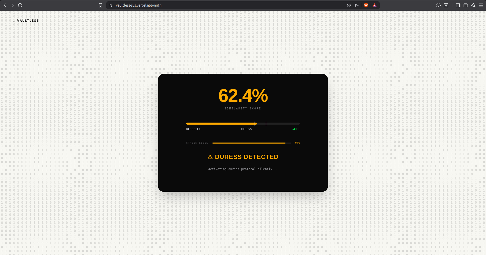

*62.4% similarity with 93% stress level: duress protocol activating silently*

</div>

1. The system appears to authenticate normally. The attacker sees a success screen.
2. The user is routed to `/ghost` instead of `/dashboard`. The Ghost page is a pixel-identical copy of the real dashboard, but it displays a fake, lower SOL balance and fabricated recent transaction history.
3. Any "send" attempt on the Ghost page fails silently, or completes against a throwaway address.
4. A `trigger_duress` instruction is broadcast to the Solana program, emitting a `DuressEvent` on-chain with the owner's public key and a timestamp. This creates a tamper-proof audit record.
5. An alert email is dispatched via EmailJS to the recovery email the user provided during enrollment. The email is sent silently and contains the timestamp and context of the duress event.

<div align="center">

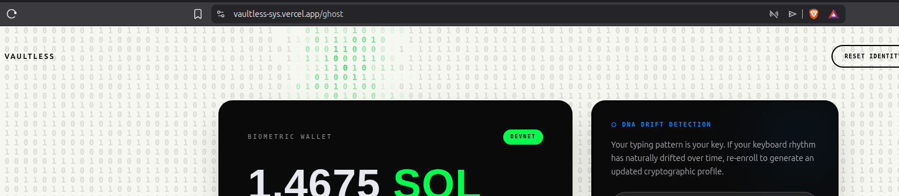

*The Ghost Wallet: indistinguishable from the real dashboard, but showing a fake balance*

</div>

The attacker sees what appears to be a successful login with a real (but lower) balance. The real wallet is untouched. The user is safe.

---

## 11. Authentication Outcomes

Every authentication attempt produces one of three outcomes based on the similarity score and the stress level:

<div align="center">

| Outcome | Score Threshold | Stress Level | System Response |
|---|---|---|---|
| **Authenticated** | > 0.70 | Normal | Access granted, real dashboard loaded |
| **Duress** | 0.60 - 0.70 or any score with high stress | Elevated (variance > 2x enrollment) | Ghost wallet loaded, alert email sent, `DuressEvent` emitted on-chain |
| **Rejected** | < 0.60 | Any | Access denied, `AuthFailed` logged on-chain, user prompted to retry |

</div>

<div align="center">

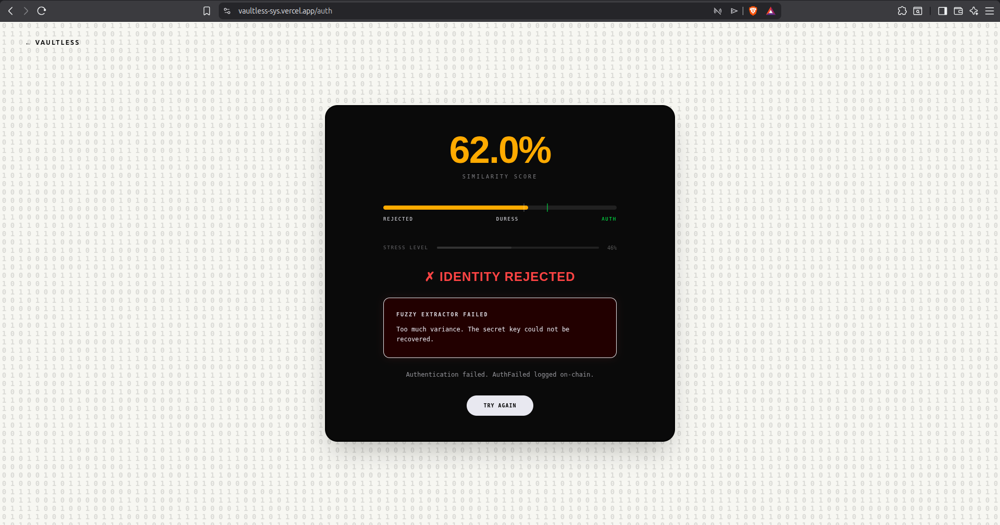

*62.0% similarity with 46% stress: fuzzy extractor variance too high, access denied*

</div>

The rejected state explicitly catches impostors. If someone who is not the enrolled user attempts to authenticate, their typing rhythm will produce a low similarity score. The Fuzzy Extractor will fail to reconstruct the secret key from the wrong typing pattern, and the authentication log will record an `AuthFailed` event on Solana.

---

## 12. Smart Contract Reference

The Solana program is written in Rust using the Anchor framework and deployed at a PDA seeded with `[b"identity", owner_pubkey]`.

**Instructions:**

| Instruction | Description |
|---|---|
| `initialize_identity(helper_data)` | Creates a new Identity PDA for the caller's wallet and stores the Fuzzy Extractor helper data |
| `update_identity(new_helper_data)` | Overwrites the helper data (re-enrollment after DNA drift) |
| `authenticate()` | Logs a successful authentication event on-chain and updates `last_auth_at` |
| `trigger_duress()` | Sets `is_locked = true` and emits a `DuressEvent` with owner pubkey and timestamp |

**Account layout:**

```rust
#[account]
pub struct Identity {
    pub owner: Pubkey,        // 32 bytes
    pub helper_data: String,  // 4 + 4096 bytes (fuzzy extractor JSON)
    pub enrolled_at: i64,     // 8 bytes (unix timestamp)
    pub last_auth_at: i64,    // 8 bytes (unix timestamp)
    pub is_locked: bool,      // 1 byte
}
```

**Events emitted:**

```rust
#[event]
pub struct DuressEvent {
    pub owner: Pubkey,
    pub timestamp: i64,
}

#[event]
pub struct AuthEvent {
    pub owner: Pubkey,
    pub timestamp: i64,
}
```

---

## 13. Repository Structure

```
VAULTLESS/
  apps/
    web/
      src/
        hooks/
          behaviouralEngine.js      DNA engine, cosine similarity, stress detection
        lib/
          solana.js                 All Solana/Anchor calls
          VaultlessContext.jsx      Global state, localStorage persistence
          duressAlert.js            EmailJS duress alert dispatch
        pages/
          Enroll.jsx                3-sample enrollment flow with live EKG
          Auth.jsx                  Live scoring, ring animation, outcome routing
          Dashboard.jsx             Real wallet: balance, send, on-chain activity
          Ghost.jsx                 Identical ghost session (imports Dashboard)
          Access.jsx                Entry point for returning users
          Lab.jsx                   Internal tuning and debug interface
        contracts/
          VaultlessCore.sol         Ethereum Solidity contract (legacy, deprecated)
    mobile/
      src/
        hooks/
          MobileBehaviouralEngine.js  Accelerometer + gyroscope + keystroke engine
      App.js                          Main mobile app entry
  program/
    programs/
      vaultless/
        src/
          lib.rs                    Anchor program: identity PDA, duress, auth events
    Anchor.toml
  CONTEXT.md                        Team shared config: thresholds, addresses, status
```

---

## 14. Local Setup

**Prerequisites:**

- Node.js 18+
- Rust (for building the Anchor program)
- Anchor CLI (`cargo install --git https://github.com/coral-xyz/anchor anchor-cli`)
- Solana CLI (`sh -c "$(curl -sSfL https://release.solana.com/stable/install)"`)
- Phantom wallet browser extension

**Web app:**

```bash
git clone https://github.com/your-org/vaultless
cd vaultless/apps/web
npm install
cp .env.example .env   # fill in the variables below
npm run dev
```

**Mobile app:**

```bash
cd vaultless/apps/mobile
npm install
npx expo start
```

**Solana program:**

```bash
cd vaultless/program
anchor build
anchor deploy --provider.cluster devnet
```

After deploying, copy the program ID from the deploy output and update `declare_id!()` in `lib.rs` and `VITE_PROGRAM_ID` in your `.env`.

---

## 15. Environment Variables

Create `apps/web/.env` with the following:

```env
VITE_PROGRAM_ID=<your deployed Anchor program ID>
VITE_SOLANA_RPC=https://api.devnet.solana.com
VITE_EMAILJS_SERVICE_ID=<your EmailJS service ID>
VITE_EMAILJS_TEMPLATE_ID=<your EmailJS template ID>
VITE_EMAILJS_PUBLIC_KEY=<your EmailJS public key>
VITE_AUTH_DEBUG=false
```

---

## 16. Tuning the DNA Engine

The behavioural engine exposes several tunable thresholds in `CONTEXT.md` and directly in `behaviouralEngine.js`.

**If scores are too similar between two different people:**

- Increase the hold time weight from `3x` to `4x` in `cosineSimilarity()` in `behaviouralEngine.js`
- Add more mouse dynamics weight by increasing the multipliers on vector indices `[46-50]`
- Lower the duress threshold temporarily to `0.65` in `Auth.jsx` to observe score distribution

**If enrollment keeps failing:**

- Confirm Phantom is on Solana Devnet
- Confirm `VITE_PROGRAM_ID` matches the deployed program
- Confirm the wallet has Devnet SOL (airdrop via `solana airdrop 2 <wallet_address> --url devnet`)

**If duress triggers too easily:**

- Raise `THRESHOLDS.DURESS_LOW` from `0.60` to `0.65` in `Auth.jsx`
- Raise the stress variance multiplier from `2` to `3` in `behaviouralEngine.js` in the `stressDetector()` function

**If the enrolled user is getting rejected too often (DNA drift):**

- The user should click "Re-Enroll" in the dashboard. Typing rhythm drifts naturally over weeks or months (illness, injury, keyboard change). Re-enrollment updates the helper data on-chain with a fresh baseline.

---

<div align="center">

**Vaultless** — No passwords. No seed phrases. Just you.


</div>
